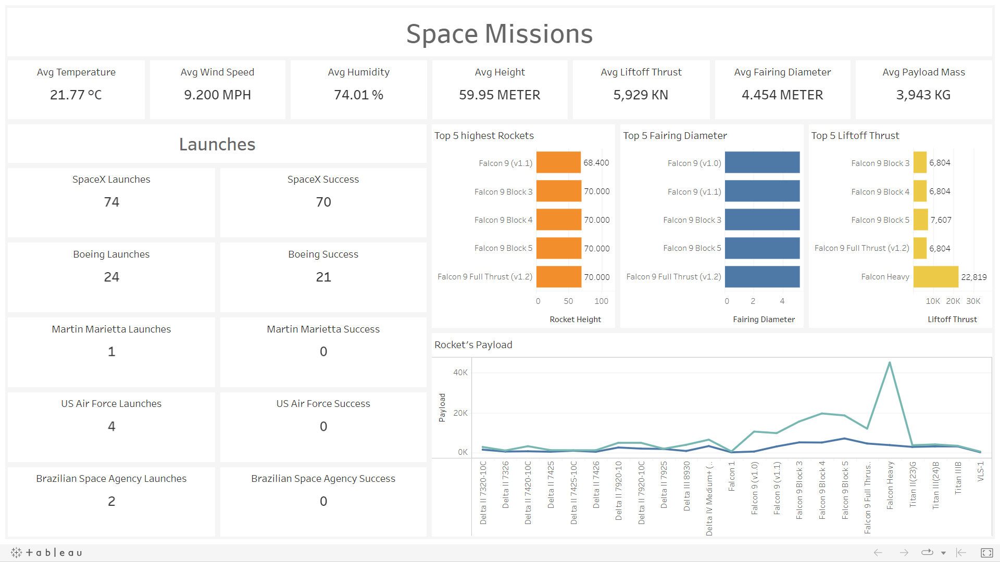

# Space Mission Analytics


Analysis of space missions of various companies around the globe.

## Tech Stack


## Download

```bash
  git clone https://github.com/Onnamission/Space-Missions-Analysis.git
```

## About

The original procedures uses python and jupyter for analysis which never explained the logic for there analysis and the jupyter notebook never provided any dashboard for clean analysis.

As the dataset is not that big, so for data insights, EXCEL was used instead of SQL. But cleaning data in the excel is not reliable at all and even more time consuming than SQL.

Too much of manual work you know.

Now here comes the role on R where you just need to define a function in a pipline.

## Data Pipeline in R

```bash
  data_clean = df %>%
    drop_na()
```

## About Dataset

The dataset was made by the acknowledgement by compelling from different space flights from a wide range of companies.

The dataset contains the following parameters:

| Parameter             | Data Type                                                                |
| ----------------- | ------------------------------------------------------------------ |
| Company | Character |
| Launch Date | Character |
| Launch Time | Character |
| Launch Site | Character |
| Temperature | Character |
| Wind Speed | Character |
| Humidity | Character |
| Vehicle Type | Character |
| Liftoff Thrust | Character |
| Payload to Orbit | Character |
| Rocket Height | Character |
| Fairing Diameter | Character |
| Payload Name | Character |
| Payload Type | Character |
| Payload Mass | Character |
| Payload Orbit | Character |
| Mission Status | Character |
| Failure Reason | Character |

Long live space missions. Thank you for the acknowledgement for providing this great dataset.


## Original Methodology
 - Data insights using Python.
 - Data cleaning using Python.
 - Data visualization using Python.
## My Methodology
 - Data insights using Excel.
 - Data cleaning using R programming.
 - Data visualization using Tableau.

## Data Cleaning

Removing unnecessary columns and replacing NAs with No Failure in failure reasons.

```bash
  data_clean = subset(data_clean, select = -c(payload_name, launch_time))
  data_clean$failure_reason[is.na(data_clean$failure_reason)] = "No Failure"
```

Converting data types and removing redundancies.

```bash
  data_clean$launch_date = as.Date(data_clean$launch_date)
  dataclean$payload_type[dataclean$payload_type == "GPS III satellites"] = "Global Positioning System"
```

Changing success to 1 and failure to 0 in mission success column. Also, converting degree farenhite to degree celsius. Then, renaming columns.

```bash
  dataclean$mission_status[dataclean$mission_status == "Success"] = 1
  dataclean$temperature_a_f = fahrenheit.to.celsius(dataclean$temperature_a_f)
```

During cleaning process, some companies data got removed as for them most of the parameter values were NA. So, doesn't made any sense of keeping it.

## New Parameters

In order to count the number of each companies launch and there success, 10 new parameters were created that are:
 - spacex
 - spacex_s
 - boeing
 - boeing_s
 - martin_marietta
 - martin_marietta_s
 - us_air_force
 - us_air_force_s
 - brazilian_space_agency
 - brazilian_space_agency_s

where s means success. In spacex column, the values from company column were copy pasted and then chose cells which have spacex string was converted to 1 and others to 0. Same procedure were applied in other created columns.
In the s (success) columns, if the value of mission success is 1 and the newly created column named after company value is 1, then the s (success) column will be 1 or else 0.

```bash
  dataclean$spacex_s[dataclean$spacex == 1 & dataclean$mission_status == 1] = 1
  dataclean$boeing_s[dataclean$boeing == 0 & dataclean$mission_status == 1] = 0
```

## Visualizations



## 🔗 Links
[](https://public.tableau.com/app/profile/aditya.kakde)

## Disclaimer

If you are using this repository, acknowledging it is important.

## Support

For support, find me 😂.

## Authors

- [@Onnamission](https://www.github.com/Onnamission)


## Acknowledgements

 - [Dataset](https://www.kaggle.com/datasets/rosetabares/spacemissionsflightstatus)
